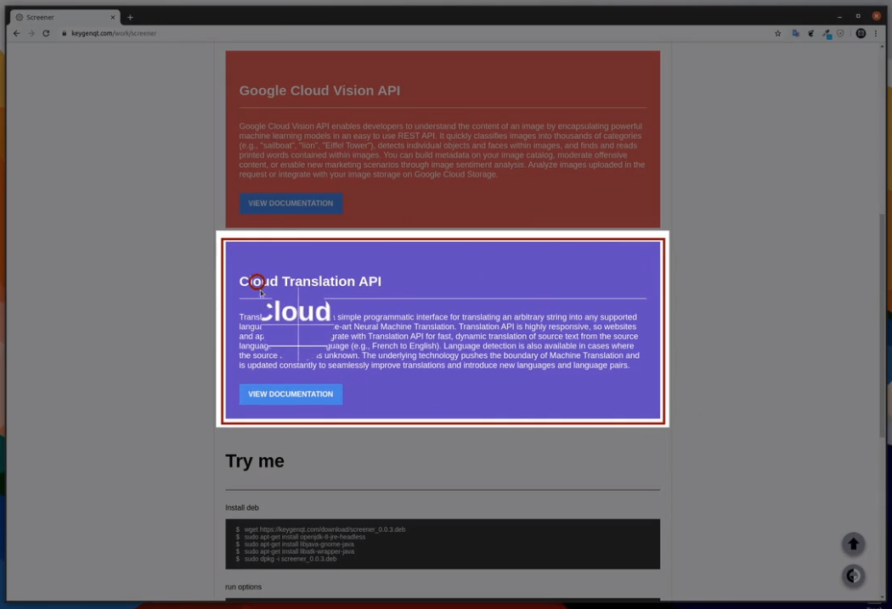

Screener
===================


## Release

[](https://snapcraft.io/screener)

### Info

Linux app for easy screenshot

* Selection area
* Selection area delay
* Desktop
* Search screenshot in Google
* Cloud Vision (select text from screenshot)
* Cloud Translate (translate select text from screenshot)
* Save image in buffer
* Save image in imgur

```
Usage: screener COMMAND=ARG...

Linux app for easy screenshot

Options
    --select                Select area
    --select-delay          Select area with delay
    --desktop               Make screenshot desktop
    --search                Search screenshot in Google search
    --vision                Get text from screenshot
    --translate             Translate text from screenshot

    --debug                 Enable processes logging terminal
    --version               Show the version and exit
    --help                  Show help
```

### Preview

